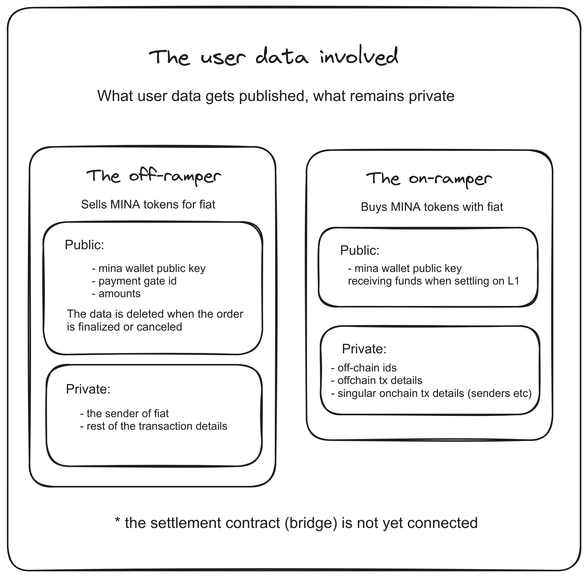
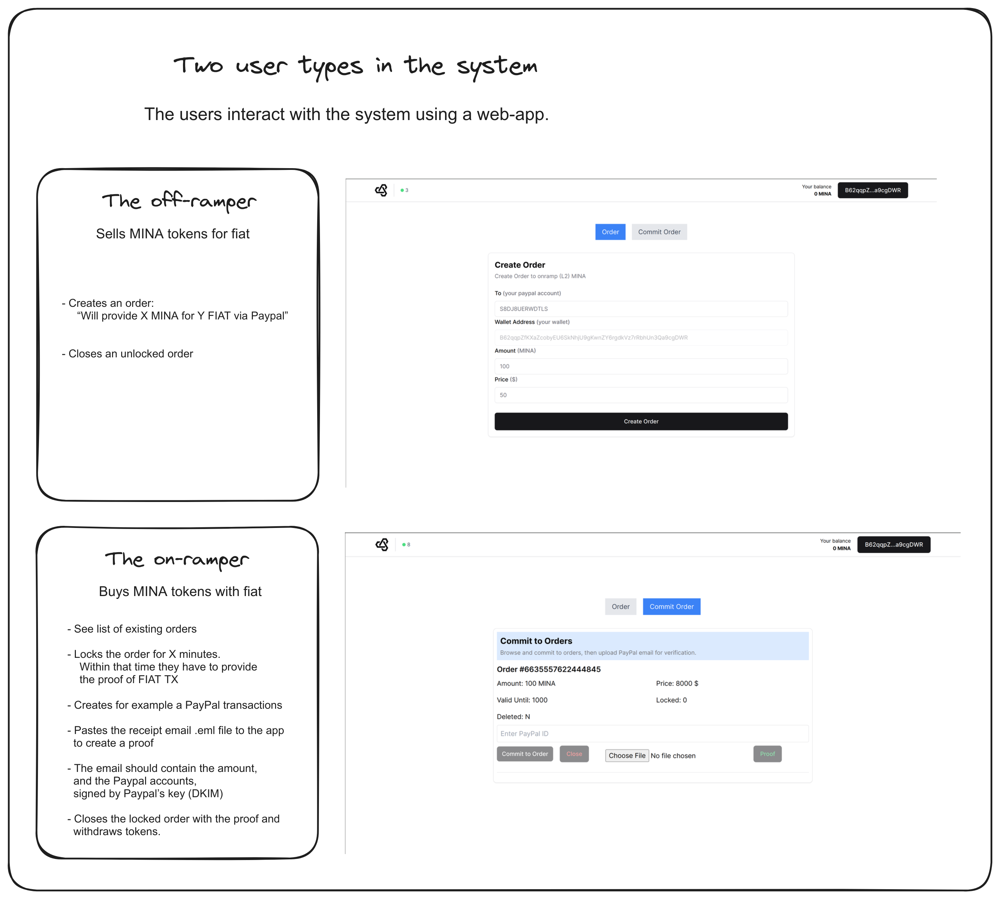

# zkMinaOnramp - zkMinaFiatBridge

This repository contains a **proof-of-concept** of a fiat(USD)-MINA bridge that aims to be off-chain identity-hiding (the on-ramper) and decentralized.

It was created during ZK Hack Krakow (2024) hackathon for the "proto-kit track"
https://zk-hack-krakow.devfolio.co/

**The project is not fully operational as of hackathon submission time** - we ran out of time before applying all the polish and functionallities it would require to be actually used.

**IMPORTANT for reviewers**
The project submission is divided into two branches:
 - `proofs2` - that contains more mocked out proofs that work with the UI
 -  `proofs-signature` - that contains better proofs, but the UI is not compatible yet.

### The goal idea overview
The goal idea is to provide a decentralized (or decentralizable) platform to create p2p orders that would trustlessly allow to exchange between FIAT and MINA without revealing token buyer off-chain identity.
To be expanded.


*Figure 1: Representation of User Roles*


*Figure 2: User Types*

### The intended proof flow

Or: How to verify the off-chain payments

1. Make a payment using the gateway with an agreed upon sender_id, receiver_id, and amount
2. Receive DKIM signed message from the payment domain
3. Build the proof by selecting and locking the order and providing the .eml file

The circuit for the proof is built with zk-email-o1js , o1js-rsa, zk-regex.
The proof verifies against the public data of the order details that
in essence is a hash of all the necessary information.

### What was accomplished
- We were able to prepare custom Protokit branch that works with the new o1js version and succesfully build a full-stack app on top of it
- The design of the system allowing for necessary interactions.
- The **almost finished** implementation of the system logic.
- Next.js web app being the user entry point - it already provides a big chunk of the
- The sequencer correctly implement the logic of the system (minus the `zkEmail` type proof verification) - it now assumes that data signed by the on-ramper is truthful.
- The suite of tests that test out the logic of the system.


### What was not accomplished

- **The essential part of verifying the e-mail receipt** - the tools we meant to used are in alpha level functionality and we ran out of time before preparing that part. 
- The proto-kit sequencer is now the only entity holding the off-chain state of the system which mean that is not yet trustless.
- **The system does not yet use L1 bridge** - instead of bridging with L1 the tokens are minted and burned.
- UI is not finished
	- it doesn't provide enough information, smooth UX and necessary feedback.
	- it doesn't work with the newest circuits we prepared
- The code quality suffered heavily because of the pace of the prototyping


### Summary

We think we have a valid proof-of-concept with essential, but well-defined gaps, that can easily (but with bigger time-budget) be filled with attainable pieces.
We showed that MINA, o1js and proto-kit provide an innovative platform for rapid prototyping of full-stack ZK-based apps and that the ecosystem is still in its
early stage.


### The potential road ahead

### How run the project


The monorepo contains 2 packages and 1 app:

- `packages/chain` contains the implementation of the proto-kit app-chain including runtime modules (something akin to "smart contracts")
- `packages/proofs` contains the implementation of the zk program for proving and verifier the authenticity of the payment receipt
- `apps/web` contains a demo UI that connects to a wallet and the locally hosted app-chain sequencer

**Prerequisites:**

- Node.js v18
- pnpm
- nvm


### Setup

```zsh
# ensures you have the right node.js version
nvm use
pnpm run setup_protokit # we need to prepare custom framework version
pnpm install
pnpm run build # this may hang during the web app compilation you may stop it
```

### The tests

The tests for the runtime modules are defined in the `chain` package

```zsh
cd packages/chain
pnpm run test
```

The tests may be seen as partial demo of the functionality.

### Running the sequencer & UI

```zsh
# starts both UI and sequencer locally
pnpm dev
# then visit localhost:3000
```
